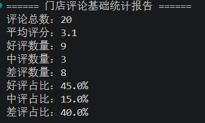
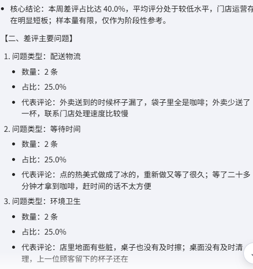
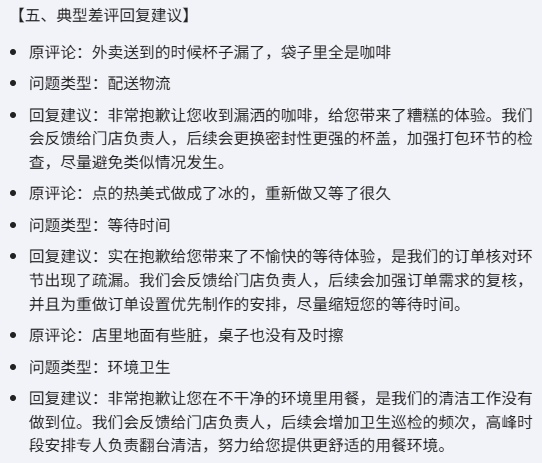
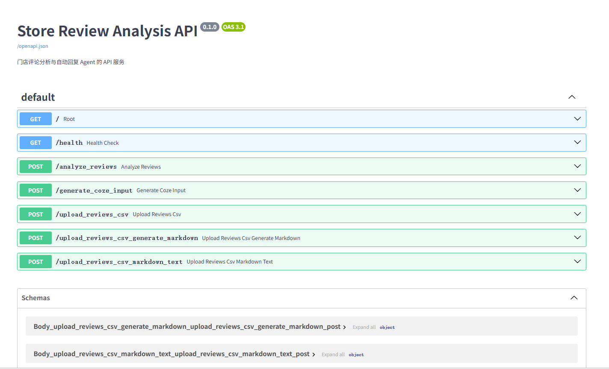
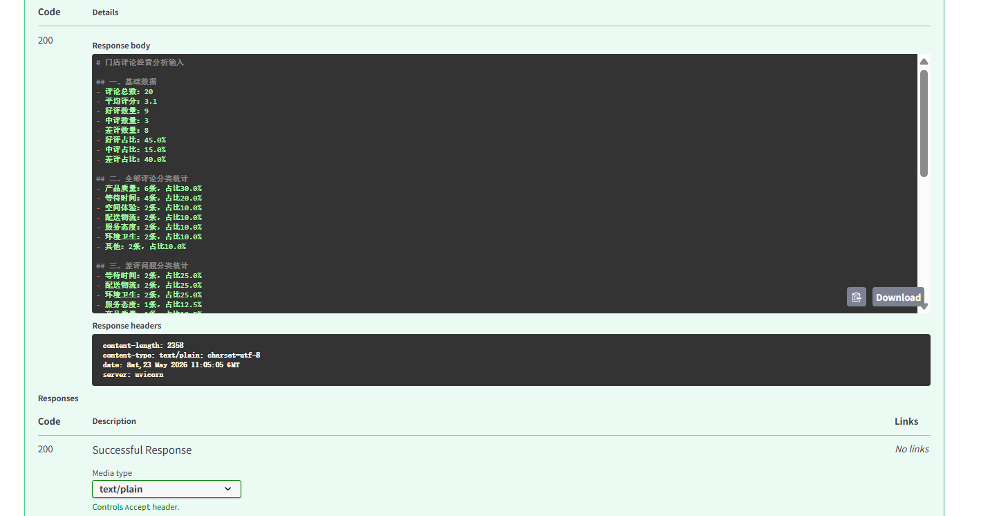
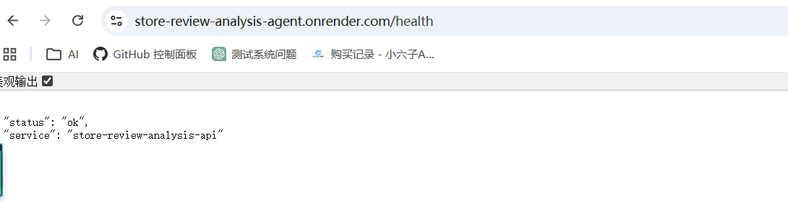
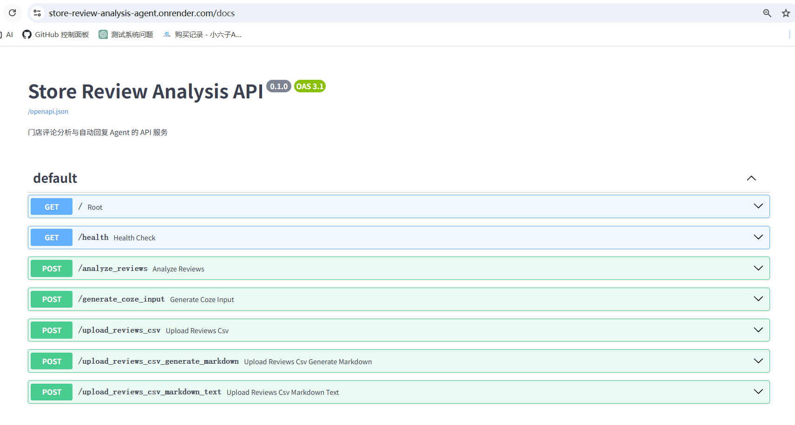
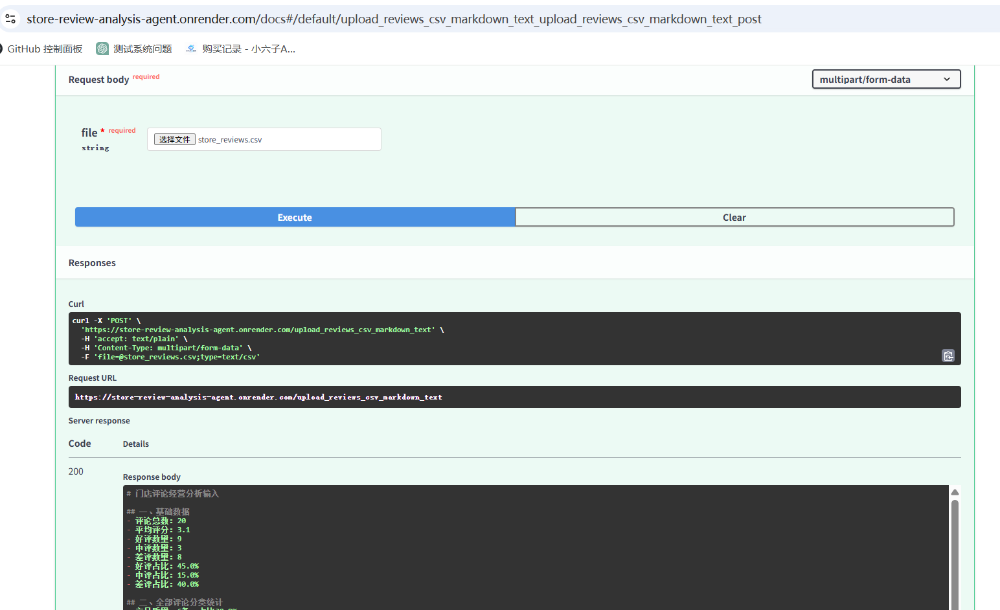
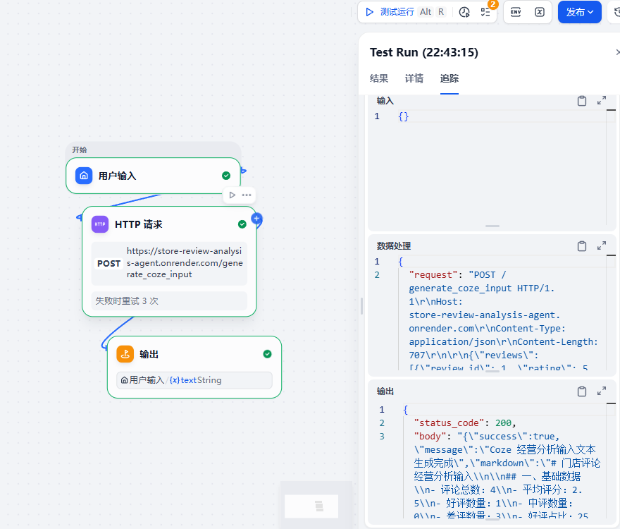
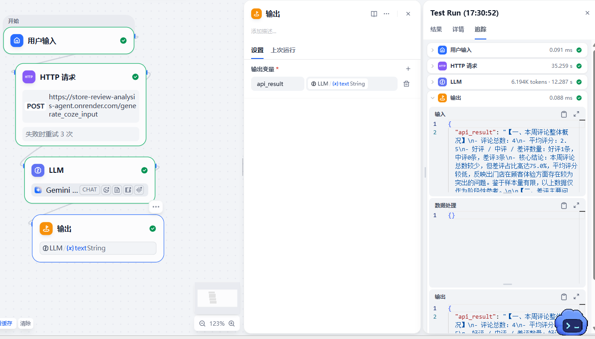

# 门店评论分析与自动回复 Agent

## 项目链接

- Coze 智能体体验链接（V1）：https://www.coze.cn/store/agent/7641188023723900968?bot_id=true
- Render 公网 API：https://store-review-analysis-agent.onrender.com
- Swagger 接口文档：https://store-review-analysis-agent.onrender.com/docs
- 项目演示视频（V1：Python + Coze）：https://pan.quark.cn/s/9365341750f9
- 项目演示视频（V2：FastAPI + Render + Dify）：https://pan.quark.cn/s/28727f491c45

## 一、项目简介

门店评论分析与自动回复 Agent 是一个结合 Python 数据处理、FastAPI 接口服务、Render 公网部署与 Dify 工作流的 AI 应用项目。

项目面向餐饮、咖啡店、零售门店等本地生活场景，能够对门店评论数据进行统计分析，识别差评集中问题，并自动生成经营分析周报、改进建议和商家回复话术。

本项目不是简单把原始评论直接交给大模型，而是先通过 Python / Pandas 对评论数据进行结构化处理，再使用 FastAPI 将分析能力封装为 API，并部署到 Render 公网环境。随后通过 Dify 的 HTTP 请求节点调用该 API，再由 Dify 的 LLM 节点生成最终门店经营分析报告。

---

## 二、项目背景

门店在日常经营中会收到大量用户评论，例如：

- 出餐等待时间长；
- 外卖撒漏或少送；
- 服务态度不好；
- 桌面和地面没有及时清理；
- 饮品口味不稳定；
- 价格偏高；
- 空间拥挤。

如果只靠人工查看评论，容易出现以下问题：

1. 评论数量多，人工整理效率低；
2. 差评原因分散，不容易快速发现主要问题；
3. 商家回复容易模板化，缺少针对性；
4. 经营改进建议缺少数据依据；
5. 门店管理者难以形成稳定的周报复盘机制。

因此，本项目尝试构建一个“评论数据处理 + AI 经营分析”的流程，帮助门店快速识别问题、生成回复建议，并形成可执行的运营改进方案。

---

## 三、核心功能

### 1. 评论数据读取

项目使用 Python 读取门店评论 CSV 文件。

CSV 字段包括：

- review_id：评论编号；
- date：评论日期；
- store_name：门店名称；
- rating：评分；
- content：评论内容；
- category：评论分类。

---

### 2. 基础评分统计

系统会自动统计：

- 评论总数；
- 平均评分；
- 好评数量；
- 中评数量；
- 差评数量；
- 好评 / 中评 / 差评占比。

---

### 3. 差评筛选

系统将评分小于等于 2 分的评论识别为差评，并导出差评数据表。

输出文件：

```text
output/negative_reviews_classified.csv
```

---

### 4. 评论问题分类

系统基于关键词规则，对评论进行初步分类。当前支持的分类包括：

- 配送物流
- 等待时间
- 服务态度
- 环境卫生
- 产品质量
- 价格问题
- 空间体验
- 其他

---

### 5. 问题分布统计

系统会统计不同问题类型出现的次数和占比，并导出：

```text
output/category_summary.csv
output/negative_category_summary.csv
```

其中，negative_category_summary.csv 用于分析差评主要集中在哪些问题。

### 6. Coze 经营周报生成

Python 脚本会自动生成一份结构化输入文件：

```text
output/coze_weekly_report_input.md
```

该文件包含：

- 基础评论统计；
- 全部评论分类统计；
- 差评问题分类统计；
- 典型差评明细；
- 给 Coze 的经营分析任务。

Coze 智能体基于该文件生成：

- 本周评论整体概况；
- 差评主要问题；
- 问题原因分析；
- 优先改进建议；
- 典型差评商家回复；
- 下周运营重点。

---

## 四、项目流程

当前项目流程如下：

```text
门店评论 CSV / JSON
      ↓
Python / Pandas 读取并清洗数据
      ↓
评分统计、差评筛选、关键词分类
      ↓
生成结构化 JSON / Markdown
      ↓
FastAPI 封装为接口服务
      ↓
Render 部署为公网 API
      ↓
Dify HTTP 请求节点调用 API
      ↓
Dify LLM 节点生成经营分析周报
      ↓
输出商家回复与运营改进建议
```

---

## 五、项目结构

```text
Store-Review-Analysis-Agent/
├── data/
│   └── store_reviews.csv
├── output/
│   ├── classified_reviews.csv
│   ├── negative_reviews_classified.csv
│   ├── category_summary.csv
│   ├── negative_category_summary.csv
│   └── coze_weekly_report_input.md
├── docs/
│   ├── 门店评论分析Agent_测试记录.md
│   ├── 项目3_API接口测试记录.md
│   ├── API到Coze闭环测试记录.md
│   ├── Dify调用公网API测试记录.md
│   ├── 作品集展示版.md
│   └── 面试讲解稿.md
├── prompt/
│   ├── coze_system_prompt.md
│   └── dify_llm_prompt.md
├── screenshots/
│   ├── python-output.png
│   ├── coze-report-result.png
│   ├── reply-suggestion-result.png
│   ├── render-health-result.png
│   ├── render-docs-result.png
│   ├── render-csv-markdown-result.png
│   ├── dify-api-markdown-success.png
│   └── dify-final-report-result.png
├── analyze_reviews.py
├── main.py
├── review_service.py
├── requirements.txt
└── README.md
```

## 六、技术栈

- Python
- Pandas
- CSV 数据处理
- 关键词规则分类
- Coze 智能体
- Prompt 结构化设计
- 门店评论分析
- 商家回复生成
- 经营周报生成
- 后端接口：FastAPI、Uvicorn
- 数据处理：Python、Pandas
- 部署平台：Render
- AI 工作流：Dify HTTP 请求节点、LLM 节点
- 输出格式：JSON、Markdown

---

## 七、运行方式

### 1. 安装依赖

```bash
pip install -r requirements.txt
```

### 2. 本地运行 Python 脚本

```bash
python analyze_reviews.py
```

运行后会生成：

```text
output/classified_reviews.csv
output/negative_reviews_classified.csv
output/category_summary.csv
output/negative_category_summary.csv
output/coze_weekly_report_input.md
```

### 3. 本地启动 FastAPI 服务

```bash
uvicorn main:app --reload
```

启动后访问：

```text
http://127.0.0.1:8000/docs
```

### 4. 公网 API 地址

本项目已部署到 Render：

```text
https://store-review-analysis-agent.onrender.com
```

Swagger 接口文档：

```text
https://store-review-analysis-agent.onrender.com/docs
```

---

## 八、API 接口说明

| 接口 | 方法 | 说明 |
|---|---|---|
| `/health` | GET | 健康检查接口 |
| `/analyze_reviews` | POST | 接收评论 JSON，返回结构化分析结果 |
| `/generate_coze_input` | POST | 接收评论 JSON，返回 Coze / Dify 可用 Markdown |
| `/upload_reviews_csv` | POST | 上传 CSV 文件，返回评论分析 JSON |
| `/upload_reviews_csv_generate_markdown` | POST | 上传 CSV 文件，返回 Markdown 字段 |
| `/upload_reviews_csv_markdown_text` | POST | 上传 CSV 文件，直接返回 Markdown 纯文本 |

核心公网接口示例：

```text
https://store-review-analysis-agent.onrender.com/generate_coze_input
```

Dify 工作流中使用 HTTP 请求节点调用该接口，获取 Markdown 分析文本后，再交给 LLM 节点生成门店经营分析周报。

---

## 九、测试数据说明

本项目使用模拟咖啡店评论数据进行测试。

测试门店：

星云咖啡上海人民广场店

测试数据共 20 条评论。

基础统计结果：

- 评论总数：20；
- 平均评分：3.1；
- 好评数量：9；
- 中评数量：3；
- 差评数量：8；
- 好评占比：45.0%；
- 中评占比：15.0%；
- 差评占比：40.0%。

---

## 十、测试结果

### 1. 差评问题分布

本轮测试中，差评问题分类统计如下：

- 配送物流：2条，占比25.0%；
- 等待时间：2条，占比25.0%；
- 环境卫生：2条，占比25.0%；
- 服务态度：1条，占比12.5%；
- 产品质量：1条，占比12.5%。

系统判断当前门店差评主要集中在：

1. 配送物流；
2. 等待时间；
3. 环境卫生。

这三类问题合计占差评总数的 75%。

### 2. Coze 经营分析输出

Coze 根据 Python 生成的结构化输入，输出了门店评论分析周报，内容包括：

- 本周评论整体概况；
- 差评主要问题；
- 每类问题原因分析；
- 优先改进建议；
- 典型差评回复建议；
- 下周运营重点。

---

## 十一、项目截图

### 1. Python 数据处理输出



### 2. Coze 经营周报输出



### 3. 典型差评回复建议



### 4. 本地 FastAPI 接口文档



### 5. 本地 CSV 上传生成 Markdown 结果



### 6. Render 公网健康检查



### 7. Render 公网接口文档



### 8. Render 公网 CSV 上传生成 Markdown 结果



### 9. Dify 调用公网 API 成功



### 10. Dify 自动生成经营分析周报



---

## 十二、项目亮点

1. 使用 Python / Pandas 对门店评论 CSV 进行结构化处理，包括评分统计、差评筛选、问题分类和问题分布统计；
2. 没有直接把原始评论交给大模型，而是先通过数据处理生成结构化结果，提高 AI 分析的准确性和可控性；
3. 使用关键词规则实现基础问题分类，支持等待时间、配送物流、服务态度、环境卫生、产品质量等常见门店问题；
4. 使用 FastAPI 将评论分析能力封装为 API 服务，支持 JSON 请求和 CSV 文件上传；
5. API 可返回结构化 JSON，也可生成 Coze / Dify 可用的 Markdown 分析文本；
6. 将 FastAPI 服务部署到 Render 公网环境，使外部系统可以通过 HTTP 请求调用；
7. 在 Dify 中通过 HTTP 请求节点调用公网 API，并由 LLM 节点自动生成门店经营分析周报；
8. 针对商家回复加入边界控制，避免虚构“已经整改”、退款、赔偿、免单等高风险表达；
9. 项目完整覆盖“数据处理 → API 封装 → 公网部署 → 工作流调用 → AI 报告生成”的 AI 应用落地链路。

---

## 十三、Prompt 设计重点

Coze 智能体的 Prompt 重点包括：

### 1. 数据约束

智能体必须基于用户提供的统计数据和差评明细进行分析，不允许编造数据。

### 2. 回复边界

商家回复不允许承诺：

- 一定退款；
- 一定赔偿；
- 一定免单；
- 一定补发；
- 已经完成整改。

如果输入数据中没有说明门店已经采取措施，只能表达“会反馈”“会检查”“会优化”。

### 3. 输出结构

智能体输出固定结构：

- 本周评论整体概况；
- 差评主要问题；
- 原因分析；
- 优先改进建议；
- 典型差评回复建议；
- 下周运营重点；
- 总结。

---

## 十四、当前局限

当前项目仍然是学习型和演示型项目，存在以下不足：

1. 数据集规模较小，目前主要使用 20 条模拟评论进行测试；
2. 评论分类主要依赖关键词规则，复杂语义下可能分类不准确；
3. Dify 当前测试主要通过 JSON 请求调用 API，Dify 直接上传 CSV 文件的工作流仍可继续优化；
4. 暂未接入真实门店平台或评论 API；
5. 暂未接入数据库，无法长期保存历史评论和分析报告；
6. 暂未加入可视化图表；
7. 暂未制作面向普通用户的前端上传页面；
8. 商家回复仍需要人工复核后再用于真实业务场景。

---

## 十五、后续优化方向

后续可以继续扩展：

- 增加 Excel 文件上传能力；
- 将关键词分类升级为 AI 语义分类；
- 在 Dify 中进一步实现文件上传调用 API；
- 增加数据库，保存历史评论和分析报告；
- 增加可视化图表，展示评分趋势和问题分布；
- 增加前端页面，支持运营人员上传评论文件并下载分析报告；
- 增加报告导出功能，例如 Markdown / Word / PDF；
- 增加 API 鉴权，避免接口被无关请求滥用；
- 增加人工审核机制，确保商家回复正式使用前可复核。

---   

## 十六、项目总结

门店评论分析与自动回复 Agent 是一个面向门店运营场景的 AI 应用项目。

项目最初通过 Python / Pandas 完成评论数据读取、评分统计、差评筛选、评论分类和结构化输入生成；后续使用 FastAPI 将评论分析能力封装为 API 服务，并部署到 Render 公网环境，使外部系统可以通过 HTTP 请求调用。

在 Dify 工作流中，项目通过 HTTP 请求节点调用公网 API，再由 LLM 节点基于 API 返回的 Markdown 分析文本生成门店经营分析周报和商家回复建议。

该项目证明了候选人具备基础 Python 数据处理能力、API 封装能力、公网部署能力、Dify 工作流编排能力、Prompt 边界控制能力，以及将 AI 应用于门店运营分析场景的实践能力。
